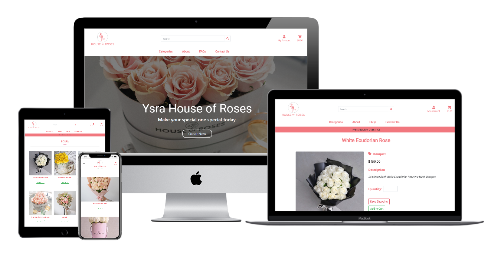

## Full Stack Frameworks with Django Milestone Project

Ysra House of Roses is my Final project which is a Full stack frame works with Django. The purpose of the project is to build a full-stack site based around business logic used. 

__________________________________________________________________________________________________________________________________________________________________________________________________

### Goal of the Website

Is to allow user to purchase roses on the website in a safe and secure way.

The website allow users to search different categories of roses. They can search through search bar by keywords.

__________________________________________________________________________________________________________________________________________________________________________________________________

### User stories

 As a user I want or I expect
 - to use an responsive ecommerce website
 - to be able to navigate the website easily
 - to able to purchase or order flower safely
 - to be able to have records or history of orders
 - to be able to receive confirmation to my email
 -  to b able to contact the shop easily
 - to be able to search just using keywords
 - to use website that is fully organized and easy to access the products
 
 ### Admin User

 As a user I want or I expect
 - to be able to update my products easily
 - to able to give my customer a good shopping experiencing at my website which they will feel safe.
 - to able to give my customer a friendly website.

 ## Wireframes

 *[Wireframe-Mobile](readMeDocs/wireframes/yhor_mobile_view.pdf)

 *[Wireframe-Desktop](readMeDocs/wireframes/yhor_desktop_wireframe.pdf)

### Existing Features

This website is a multiple website which consit of 
- categories tab which has 
  - 4 kind of categories pages
- Product page
- Product details page
- About page
- Faqs page
- Contact Page
- Cart page
- Checkout Page
- Order Confirmation Page

* This Website has an Search Bar where the usser can able to search using keywords.
* This website has button to view all products at hero image.
* This website has contact form that allow the user to send inquiries.
* This website has quantity selector.

### Features Left to Implement

This website is not yet complete, there are still a lot of Features need to implement like 

- user to be able to choose how many roses they want to have in one set of arrangement
- user have opportunity to put a personal message with the flower
- user will be able to choose color of a rose according to what arrangement or categories they choose
- user will able to have their own profile and save their order history and able to set and rest their password
- user will be able sort the product according to their preferences
- user will be able to rate the product
- user will be able to mark the product they like as their favorite
- Footer
- Bread Crumbs

## Technologies used

- Gitpod : IDE used to build the website.
- [Heroku](https://heroku.com/) to host the project.
- [Github](https://github.com/) A remote repository used to store the source code for the project.
- [Balsamiq](https://balsamiq.com/): Wireframe builder application.
- [Bootstrap](https://getbootstrap.com/) : A framework to help you design websites faster and easier
- [Google Fonts](https://fonts.google.com/) : For font style.
- [Materialize](https://materializecss.com/) : Front-end framework for interface and ease of use.
- [Font Awesome](https://fontawesome.com/o) : Icon generator
- [jQuery](https://jquery.com/) : For the functioning of the responsive navbar through Javascript.
- [Django](https://www.djangoproject.com/) as python web framework for rapid development and clean design.
- [Stripe](https://stripe.com) as payment platform to validate and accept credit card payments securely.
- [Django Crispy Forms](https://django-crispy-forms.readthedocs.io/en/latest/) to style django forms.
- [Gunicorn](https://pypi.org/project/gunicorn/) WSGI HTTP Server for UNIX to aid in deployment of the Django project to heroku.
- [Pillow](https://pillow.readthedocs.io/en/stable/) as python imaging library to aid in processing image files to store in database.
- [Psycopg2](https://pypi.org/project/psycopg2/) as PostgreSQL database adapter for Python.
- Difftools
## Languages

- HTML
- CSS
- JavaScript
- Python
    -Django

### Browerser Compatibility
- Firefox: Works as intended.
- Chrome: Works as intended.
- Edge: Works as intended.
- Safari: Works as intended.

### Functionality Failures
Due to Limited time in my end, there are some problems that has been not fix, yet I will surely fix in the future.

- Stripe payment
- Showing Purchased Confirmation
- Account Registration
- Contact Form Validation
- Media Queries

### Requirements Failures 

- AWS Amazon connection to view the static in the website
- Stripe Payment
- Code comments
- Code Beautifying
- Code Factoring
- User Aunthentication
- Testing

DEPLOYMENT
Running Code Locally

1. Follow this link to my Repository on Github and open it.

2. Click Clone or Download.

3. In the Clone with HTTPs section, click the copy icon.

4. In your local IDE open Git Bash.

5. Change the current working directory to where you want the cloned directory to be made.

6. Type git clone, and then paste the URL you copied earlier.

7. Press enter and your local clone will be ready.

8. Create and start a new environment:
   python -m .venv venv source env/bin/activate

9. Install the project dependencies:
    pip install -r requirements.txt

10. Create a new file, calle9.d env.py and add your environment variables:

import os
os.environ.setdefault("STRIPE_PUBLISHABLE", "secret key here") os.environ.setdefault("STRIPE_SECRET", "secret key here") os.environ.setdefault("DATABASE_URL", "secret key here") os.environ.setdefault("SECRET_KEY", "secret key here") os.environ.setdefault("AWS_ACCESS_KEY_ID", "secret key here") os.environ.setdefault("AWS_SECRET_ACCESS_KEY", "secret key here")

11. Go to settings.py file and add your environment variables.

12. Add env.py to .gitignore file

13. Go to terminal and run the following: python3 manage.py makemigrations, then python3 manage.py migrate to migrate all existing migrations to postgres database.

14. Create a superuser: python3 manage.py createsuperuser

15. Run it with the following command:
    python manage.py runserver

16. Open localhost:8000 on your browser

17. Add /admin to the end of the url address and login with your superuser account and create new products.

### Deployment to Heroku
The following steps were taken in order to deploy this site to Heroku:

1. Created a new app in Heroku with a unique name, chose my region

2. Went to Resources, within Add-ons searched Heroku Postgres, chose Hobby Dev - Free version, then clicked Provision button.

3. In Settings clicked on Reveal Config Vars button, and copied the value of DATABASE_URL

4. Returned to terminal window and run sudo pip3 install dj_database_url

5. Also run sudo pip3 install psycopg2. Created a requirements.txt file using the terminal command pip3 freeze > requirements.txt

6. Went to settings.py and added import dj_database_url and updated DATABASES = {'default': dj_database_url.parse(os.environ.get('DATABASE_URL'))} also updated env.py with os.environ.setdefault("DATABASE_URL", "postgres://postgres key - copied earlier from Heroku")

7. I run python3 manage.py makemigrations, then python3 manage.py migrate to migrate all existing migrations to postgres database.

8. I created a superuser: python3 manage.py createsuperuser

###### Note

*** other step was not able to implement due to AWS has up to 24hr of activation, I tried to do Heroku Django Static assets, yet due to limited time and I was working with this in last minute, it did not work for me. (Surely will fix thall the issues after the submission.)

##### Reflection
I know to myself that this project will not meet the passing grade as a lot of functionality and features I have not implemented good.

## Credits

### Contents
- All the picture was taken from House of Roses Flowershop ph Instagram
- Helpful Website
    - Bootstrap
    - Stockoverflow
    - Mdbootstrap
    - Youtube tutorial about eccomerce

### Media

- All the picture was taken from House of Roses Flowershop ph Instagram
- The Logo was created from [Free Logo Design](https://free-logo-design.net/food-drinks/free-coffee-logo-design)

### Video Guide
- (Inspired by) Boutique Ado is my guide doing this project, I follow step by step.
- Most of the Codes was taken from Boutique Ado
- The Navbar, Checkout form was inspired by Boutique Ado

## Acknowledgement

- I would like to thank my Mentor Brian Macharia  guiding me through out the process of this project, for his never ending patience and support.
- The Tutors who guided and helped me for all of my questions and for their patiences.
