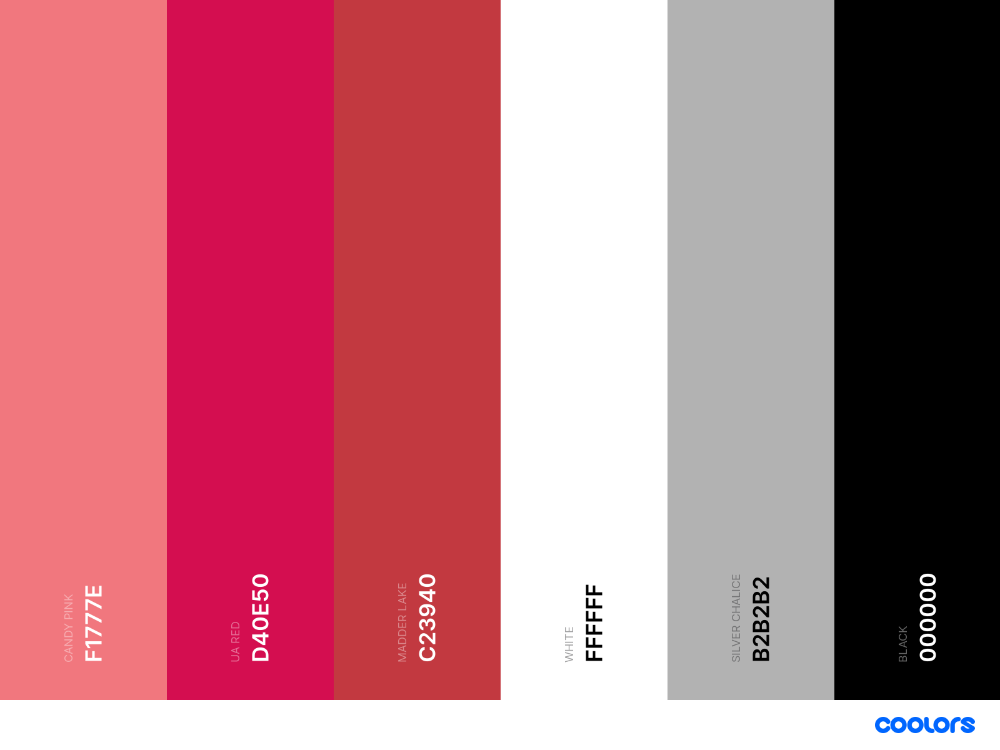

## Full Stack Frameworks with Django Milestone Project

Ysra House of Roses is my Final project which is a Full stack frame works with Django. The purpose of the project is to build a full-stack site based around business logic used. 

__________________________________________________________________________________________________________________________________________________________________________________________________

### Goal of the Website

Is to allow user to purchase roses on the website in a safe and secure way.

The website allow users to search different categories of roses. They can search through search bar by keywords.

__________________________________________________________________________________________________________________________________________________________________________________________________

### User stories

 As a user I want or I expect
 - to use an responsive ecommerce website
 - to be able to navigate the website easily
 - to able to purchase or order flower safely
 - to be able to have records or history of orders
 - to be able to receive confirmation to my email
 - to be able to contact the shop easily
 - to be able to update the amount of products in my shopping bag
 - to be able to search just using keywords
 - to be able to have or not have a user account
 - to be able to access the platform from a desktop, tablet and smartphone.
 - to use website that is fully organized and easy to access the products
 
 ---
## Site Design

### Wireframes

 *[Wireframe-Mobile](readMeDocs/wireframes/yhor_mobile_view.pdf)

 *[Wireframe-Desktop](readMeDocs/wireframes/yhor_desktop_wireframe.pdf)

### Color Scheme

The website is is simple and minamalist that gives you relaxing and calm view. The main color of the website is the combination of Candy pink and White which is the background.

### Typography

This website has only 1 font style which is Roboto.

---

### Existing Features

This website is a multiple website which consit of 
- categories tab which has 
  - 4 kind of categories pages
- Product page
- Product details page
- About page
- Faqs page
- Contact Page
- Cart page
- Checkout Page
- Order Confirmation Page

* This Website has an Search Bar where the user can able to search using keywords.
* This website has button to view all products at hero image.
* This website has contact form that allow the user to send inquiries.
* This website has quantity selector.

---

### Features Left to Implement

There are some of features left to implement in the future which I could not add to the project this time due to time constraints. 
These features are great to be added for a more complete online shop service which would lead to higher customer satisfaction.

- user to be able to choose how many roses they want to have in one set of arrangement
- user have opportunity to put a personal message with the flower
- user will be able to choose color of a rose according to what arrangement or categories they choose
- user will be able sort the product according to their preferences
- user will be able to rate the product
- user will be able to mark the product they like as their favorite
- Footer
- Bread Crumbs

---
# Information Architecture
## Database choice
- Development phase
**SQLight** database was used for the development which is installed with Django. 

- Deployment phase
**PostgreSQL** was used on deployment stage, which is provided as add-on by Heroku application.

- User model is provided as a default by [Django's authentication system](https://docs.djangoproject.com/en/3.1/ref/contrib/auth/).

---

## Technologies used

- Gitpod : IDE used to build the website.
- [Heroku](https://heroku.com/) to host the project.
- [Github](https://github.com/) A remote repository used to store the source code for the project.
- [Balsamiq](https://balsamiq.com/): Wireframe builder application.
- [Bootstrap](https://getbootstrap.com/) : A framework to help you design websites faster and easier
- [Google Fonts](https://fonts.google.com/) : For font style.
- [Materialize](https://materializecss.com/) : Front-end framework for interface and ease of use.
- [Font Awesome](https://fontawesome.com/o) : Icon generator
- [jQuery](https://jquery.com/) : For the functioning of the responsive navbar through Javascript.
- [Django](https://www.djangoproject.com/) as python web framework for rapid development and clean design.
- [Stripe](https://stripe.com) as payment platform to validate and accept credit card payments securely.
- [Django Crispy Forms](https://django-crispy-forms.readthedocs.io/en/latest/) to style django forms.
- [Gunicorn](https://pypi.org/project/gunicorn/) WSGI HTTP Server for UNIX to aid in deployment of the Django project to heroku.
- [Pillow](https://pillow.readthedocs.io/en/stable/) as python imaging library to aid in processing image files to store in database.
- [Psycopg2](https://pypi.org/project/psycopg2/) as PostgreSQL database adapter for Python.
- Difftools
## Languages

- HTML
- CSS
- JavaScript
- Python
    -Django

---
## Testing

### Manual Testing

Manual testing was conducted with each feature and were conducted on the deployed site on Heroku.

#### Responsiveness

- **Test**:
    - check each page of the website from multiple devices and multiple browsers
    - open the website in the Google Dev Tools and click on "Responsive" to check all pages for all resolutions from 320px and above

- **Results**: Some responsiveness issue encountered
    - Navbar on smaller screen - the cart icon is positioning under the logo
    - Some buttons are not aligned
    - Some images are stretch on the screen

- **Verdict**: The issues were not fix due to time constraints.

#### Search bar 

- **Test**: 
    - enter any search word into the search box to see if it redirects to the products page with correct results displayed
    - make search queries from different pages to make sure it works accross all the website

- **Results**:
    - the search query is working as it should be.
    - search bar redirects to the words that is searched.

#### Products and product details pages

- **Test**: 
    - verify that the expected text and images are displayed correctly in both products and product details pages.
    - click on the "View Details" button and on the product image on the all products page.
    - selecting category and see if redirect to the correct category
    - Quantity counter if it works properly

- **Results**:
    - the text and images are displayed correctly in products and product details pages.
    - "View Details" button redirecting correctly to the certain product that being chose.
    - selecting the category is redirecting correctly.
    - quantity counter needed to click up and down arrow to show the quanity of desired order.

#### Contact page
    
- **Test**: 
    - try to submit an empty Contact form
    - try to enter incorrect email address (without @)
    - try to submit the form with all valid information
    - check the map, clicking on the red marker, zoom controllers

- **Results**:
    - the image and contact information are displayed correctly on different screens
    - if the form was valid and "Send" button clicked, a user is redirected to the "Thank you" page, informing that the message was sent.
    - if the form was submitted successfully, an admin of the website received the real message on the email.
    - map on the contact page displays the correct location, the Info Window shows the opening hours, when the red marker is clicked. Zoom controllers also work correctly.

- **Verdict**: Test passed

#### Cart page

- **Test**: 
    - verify that the text and images of the added items are displayed correctly 
    - check if the quantity counter works propely and gives an error message if the number is out side of the range (1-99)
    - if Remove/Update link works properly.

- **Results**:
    - information abour all the items is displayed correctly
    - the quantity counter works as properly.
    - remove/Update link works as expected.

- **Verdict**: Test passed

#### Checkout and checkout success pages

- **Test**: 
    - verify that the text and images(Order summary) are displayed correctly 
    - click on the "Edit cart" link
    - try to submit an empty field set (check each section- Personal details, Shipping Info and Payment)
    - try to put an incorrect information (e.g. email without @)
    - complete checkout process and by entering 
    
- **Results**:
    - if not logged in, a message appears at the end of the form: "Create an account or login to save this information".
    - all the webhooks in Stripe returned success after the checkout.
    - after completing an order it redirets to order confirmation page
    - the customer received the order confirmation email to the email address that was added to the checkout page.

- **Verdict**: Test passed
    
---
### Browerser Compatibility
- Firefox: Works as intended.
- Chrome: Works as intended.
- Edge: Works as intended.
- Safari: Works as intended.

### DEPLOYMENT
Running Code Locally

1. Follow this link to my Repository on Github and open it.

2. Click Clone or Download.

3. In the Clone with HTTPs section, click the copy icon.

4. In your local IDE open Git Bash.

5. Change the current working directory to where you want the cloned directory to be made.

6. Type git clone, and then paste the URL you copied earlier.

7. Press enter and your local clone will be ready.

8. Create and start a new environment:
   python -m .venv venv source env/bin/activate

9. Install the project dependencies:
    pip install -r requirements.txt

10. Create a new file, calle9.d env.py and add your environment variables:

import os
os.environ.setdefault("STRIPE_PUBLISHABLE", "secret key here") os.environ.setdefault("STRIPE_SECRET", "secret key here") os.environ.setdefault("DATABASE_URL", "secret key here") os.environ.setdefault("SECRET_KEY", "secret key here") os.environ.setdefault("AWS_ACCESS_KEY_ID", "secret key here") os.environ.setdefault("AWS_SECRET_ACCESS_KEY", "secret key here")

11. Go to settings.py file and add your environment variables.

12. Add env.py to .gitignore file

13. Go to terminal and run the following: python3 manage.py makemigrations, then python3 manage.py migrate to migrate all existing migrations to postgres database.

14. Create a superuser: python3 manage.py createsuperuser

15. Run it with the following command:
    python manage.py runserver

16. Open localhost:8000 on your browser

17. Add /admin to the end of the url address and login with your superuser account and create new products.

### Deployment to Heroku
The following steps were taken in order to deploy this site to Heroku:

1. Created a new app in Heroku with a unique name, chose my region

2. Went to Resources, within Add-ons searched Heroku Postgres, chose Hobby Dev - Free version, then clicked Provision button.

3. In Settings clicked on Reveal Config Vars button, and copied the value of DATABASE_URL

4. Returned to terminal window and run sudo pip3 install dj_database_url

5. Also run sudo pip3 install psycopg2. Created a requirements.txt file using the terminal command pip3 freeze > requirements.txt

6. Went to settings.py and added import dj_database_url and updated DATABASES = {'default': dj_database_url.parse(os.environ.get('DATABASE_URL'))} also updated env.py with os.environ.setdefault("DATABASE_URL", "postgres://postgres key - copied earlier from Heroku")

7. I run python3 manage.py makemigrations, then python3 manage.py migrate to migrate all existing migrations to postgres database.

8. I created a superuser: python3 manage.py createsuperuser

| KEY                   | VALUE                            |
| --------------------- | -------------------------------- |
| AWS_ACCESS_KEY_ID     | <your_aws_access_key_id>         |
| AWS_SECRET_ACCESS_KEY | <your_aws_secret_key_access_key> |
| DATABASE_URL          | <your_database_url>              |
| EMAIL_HOST_PASS       | <your_email_host_pass>           |
| EMAIL_HOST_USER       | <your_email_host_user>           |
| SECRET_KEY            | <your_secret_key>                |
| STRIPE_PUBLIC_KEY     | <your_stripe_public_key>         |
| STRIPE_SECRET_KEY     | <your_stripe_secret_key>         |
| STRIPE_WH_SECRET      | <your_stripe_wh_secret>          |
| USE_AWS               | True                             |
|                       |                                  |

## Credits

### Contents
- All the picture was taken from House of Roses Flowershop ph Instagram
- Helpful Website
    - Bootstrap
    - Stockoverflow
    - Mdbootstrap
    - Youtube tutorial about eccomerce

### Media

- All the images was obtained from House of Roses Flowershop ph Instagram
- The Logo was created from [Free Logo Design](https://free-logo-design.net/food-drinks/free-coffee-logo-design)

### Video Guide
- Boutique Ado is my guide doing this project, I follow step by step.
- Most of the Codes was taken from Boutique Ado and some from art of tea
- The Navbar, Checkout form was inspired by Boutique Ado

### Inspiration
- Botique Ado
- Art of tea 
- thehouseofMouse

## Acknowledgement

- I would like to thank my Mentor Brian Macharia  guiding me through out the process of this project, for his never ending patience and support.
- The Tutors who guided and helped me for all of my questions and for their patiences.

### Disclaimer

The content of this website, including the images used, are for educational purposes only.